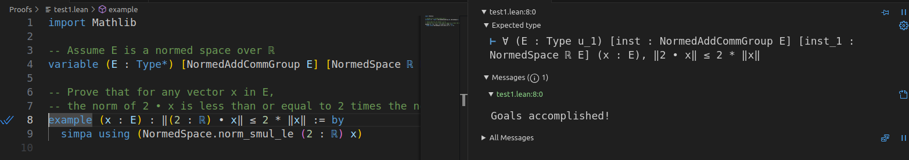

# MathLib-Lean-Proofs-Experiments-2025

Experiments with Matlib Lean Proofs


# Setup 

1) Initialize with MathLib

```
lake init proofs math
```

2) Fetch dependencies 

```
lake update
```

3) Fetch Cache

```
lake exe cache get
```


4) Align toolchain if needed 

```
cp .lake/packages/mathlib/lean-toolchain ./lean-toolchain
```


5) Build 

```
lake build
```

It should return 

```
Build completed successfully (4 jobs).
```

---

# Use 

Install the Lean extension in VS Code and explore the proofs 


# Gotchas

## Rebuild

In case something goes wrong, rebuild following these instructions 

1) Clean up 

```
rm -rf .lake
```

2) Update 

```
lake update
```

3) Get Cache 

```
lake exe cache get
```

4) Build 

```
lake build
```


# Test 

## Checking test1.lean

Opening `test1.lean` in this repo, you should see 




